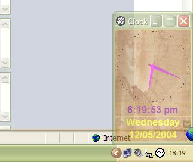



## Timed Shutdown Clock 7\.0 \(Full Freeware App\)

### Description

Shuts down the computer either at a pre-defined time or after a certain period idle. Fully customizable and capable of running on win9x, winNT, winME, win2000, winXP. Includes most or parts of my other submittions including registry access, ini files, encryption, system tray (with auto-reload feature), system specific features like the win2000 and xp window layering, snapping windows to the size of the screen, using the system fonts, changing thread priority etc. There is very little that's NOT customizable in this. You'll need to register the system tray ocx and the idletime dll. This is a freeware program so feel free to use any code. Votes are, as always, welcome. Comments and suggestions even more so. If you feel that there is way too much code in this for what is achieved, then keep in mind that mostly APIs are used for speed and effiency reasons and also that some of the modules are general and not all code in them is used in this particular app :-)
 
### More Info
 
Shutdown settings

             |
---                |---
**Submitted On**   |2004-05-01 12:16:28
**By**             |[Eric O'Sullivan](https://github.com/Planet-Source-Code/PSCIndex/blob/master/ByAuthor/eric-o-sullivan.md)
**Level**          |Advanced
**User Rating**    |5.0 (10 globes from 2 users)
**Compatibility**  |VB 6\.0
**Category**       |[Complete Applications](https://github.com/Planet-Source-Code/PSCIndex/blob/master/ByCategory/complete-applications__1-27.md)
**World**          |[Visual Basic](https://github.com/Planet-Source-Code/PSCIndex/blob/master/ByWorld/visual-basic.md)
**Archive File**   |[Timed\_Shut1744635132004\.zip](https://github.com/Planet-Source-Code/eric-o-sullivan-timed-shutdown-clock-7-0-full-freeware-app__1-53731/archive/master.zip)

### API Declarations

lots :-)

